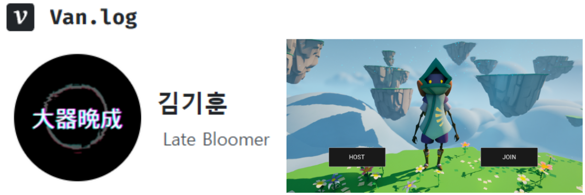

# $\large\bf\color{#FFFFFF}Blaster$

### $\large\bf\color{#CD5C5C}결과물$

<b>[ Blog URL ]</b> 
$\color{#4F4F4F}(\ ↓ 이미지\ 클릭시\ 해당\ 페이지로\ 이동합니다.↓\ )$ 

 

<b>[ Youtube URL ]</b> 
$\color{#4F4F4F}(\ 준비중입니다.\ )$ 
<!-- 
$\color{#4F4F4F}(\ ↓ 이미지\ 클릭시\ 해당\ 페이지로\ 이동합니다.↓\ )$ 

 
-->

<b>[ 기술문서 URL ]</b> 
$\color{#4F4F4F}(\ 준비중입니다.\ )$ 
<!--
$\color{#4F4F4F}(\ ↓ 이미지\ 클릭시\ 해당\ 페이지로\ 이동합니다.↓\ )$ 

 
-->

<b>[ Notion URL ]</b> 
$\color{#4F4F4F}(\ 준비중입니다.\ )$ 
<!--
$\color{#4F4F4F}(\ ↓ 이미지\ 클릭시\ 해당\ 페이지로\ 이동합니다.↓\ )$ 

 
-->

### $\large\bf\color{#CD5C5C}프로젝트\ 명$

Blaster

### $\large\bf\color{#CD5C5C}프로젝트\ 인원$

1명 (김기훈)

### $\large\bf\color{#CD5C5C}목적$

① Unreal Engine5 의 활용법 학습 
② 게임 엔진의 구조와 흐름에 대한 이해 
③ Unreal Blueprint 와 Unreal C++ 의 활용 능력의 향상 
④ 기능 구현 및 응용 능력 향상 
